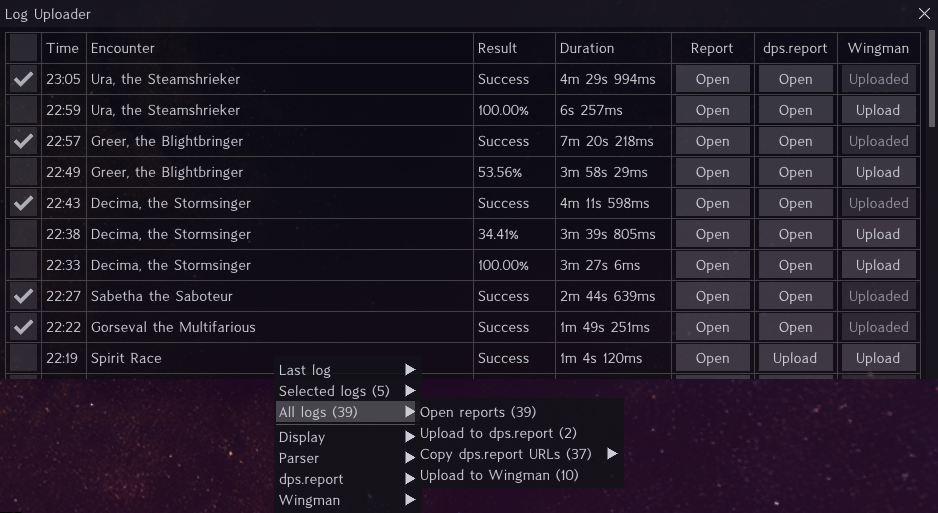
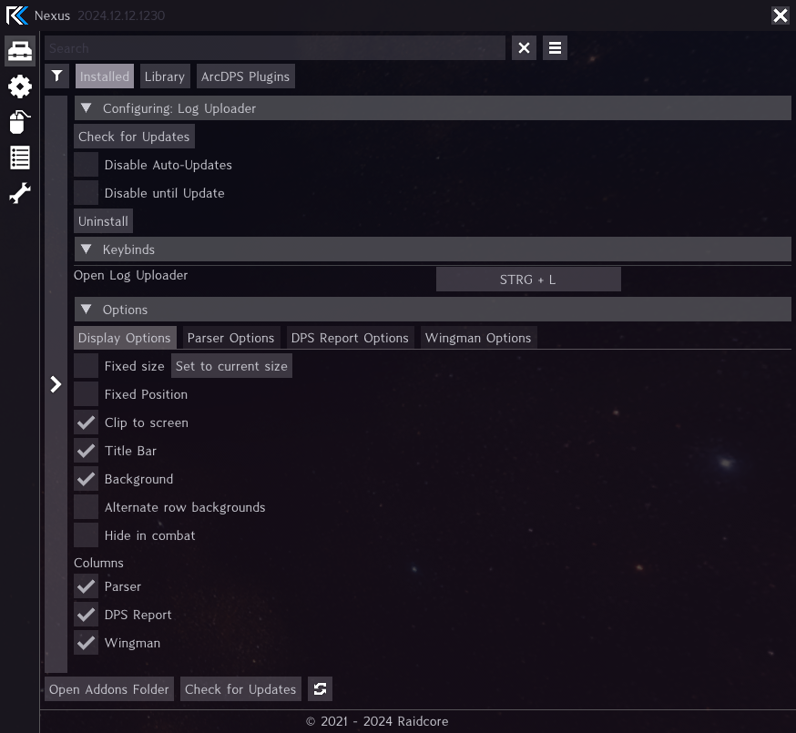
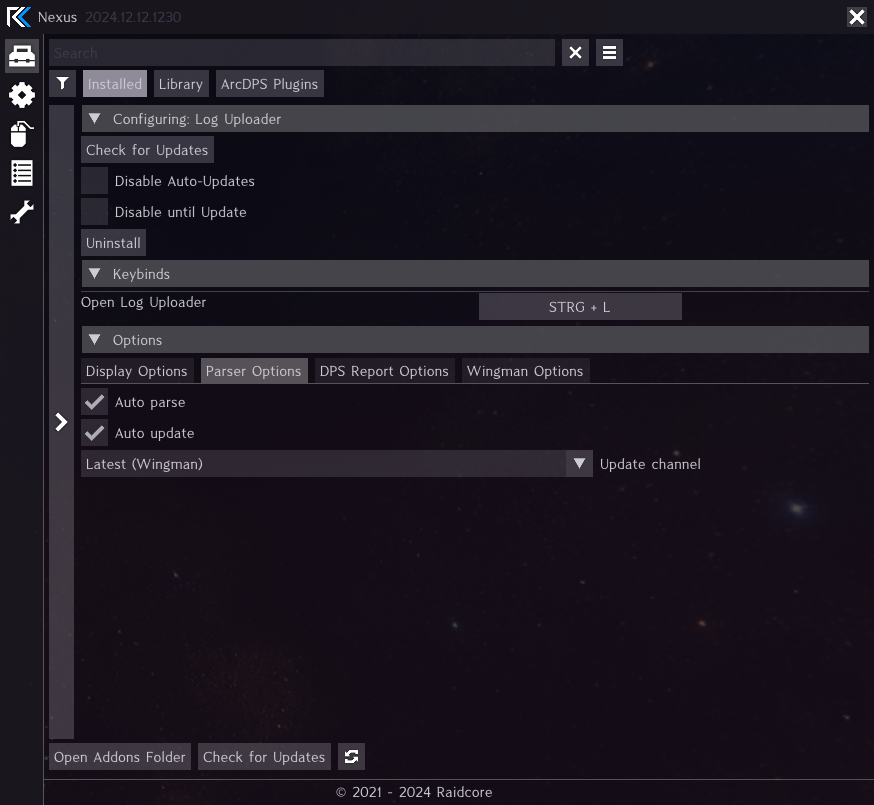
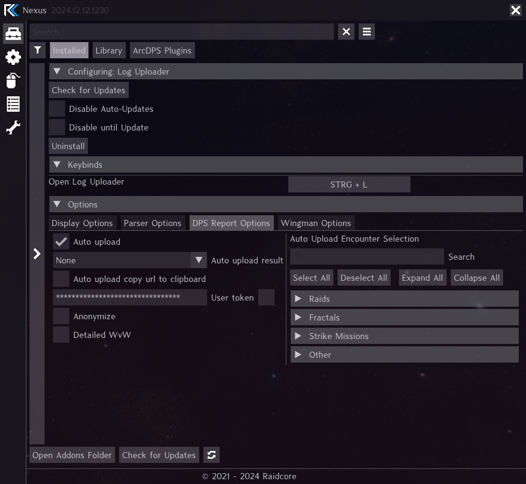
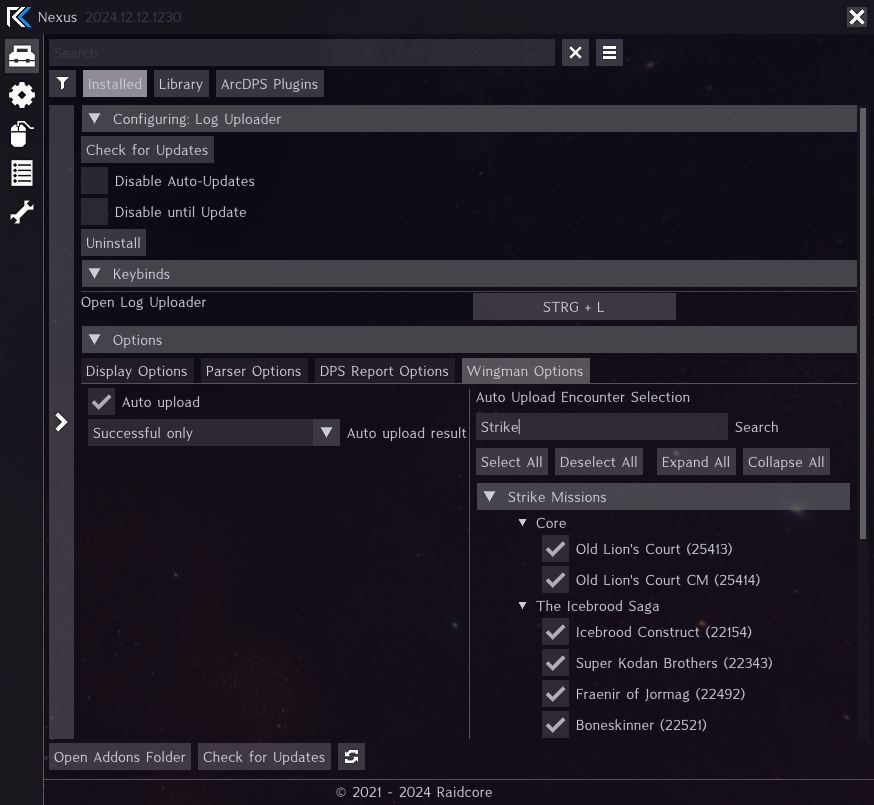

# Nexus Log Uploader

[Nexus](https://github.com/RaidcoreGG/Nexus) addon to automatically parse new arcdps logs locally and optionally upload them to [dps.report](https://dps.report) or [Wingman](https://gw2wingman.nevermindcreations.de).

## Screenshots





W

## Building

**Prerequisites:** Visual Studio 2022 with C++ workload, [vcpkg](https://github.com/microsoft/vcpkg) installed and integrated (`vcpkg integrate install`).

```powershell
git clone --recurse-submodules https://github.com/eioz/nexus-log-uploader.git
cd nexus-log-uploader

.\build.ps1                # Release x64
.\build.ps1 -Config Debug  # Debug x64
.\build.ps1 -Rebuild       # Clean + rebuild
.\build.ps1 -Clean         # Remove build artifacts
.\build.ps1 -Mock          # Build and launch in nexus-mock
```

Output: `build\x64\Release\log_uploader.dll`
